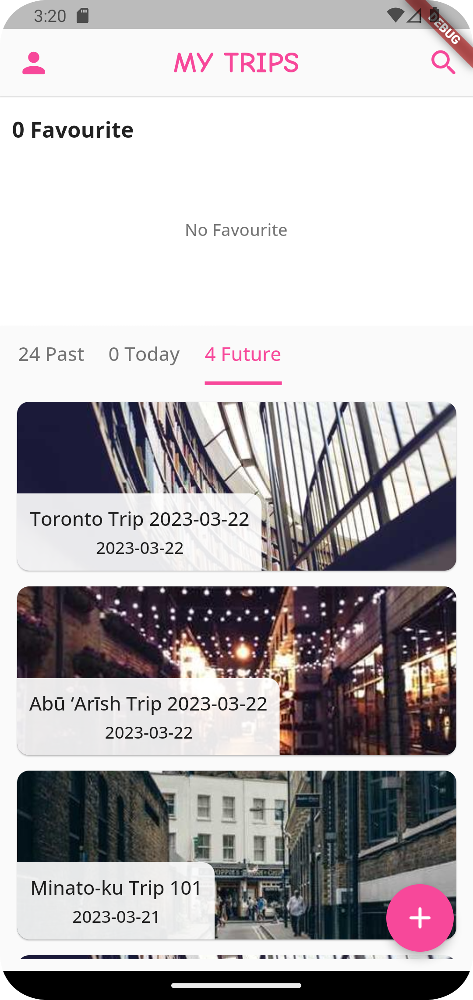

# Leisurely-backend

### Introduction
This is the backend of Leisurely. Leisurely is an itinerary day-trip planner app 
that generate an at most one day trip plan that matches user preference.

This backend system can be deployed on multiple server connected via a load balancer to 
achieve the best performance. It contains docker image for Postgresql database, middleware
written in Go and NLP module written in Python

### App sample
The home page, user page are shown below

  
  

The trip can be generated using the following page

  
  

User can choose the tags attached to the plan, budget, location anywhere in the world, by public transit or by driving
to generate the trip plan, or choose minimum input (date, location and the time interval they want to go out).

After the plan is generated, user can rearrange each place they are going, and also choose other place to go from
a list of alternatives that matches the user's preference.

  
  
  
  

Once the trip plan is confirmed, the trip will be saved to home page with a theme image attached to it.
